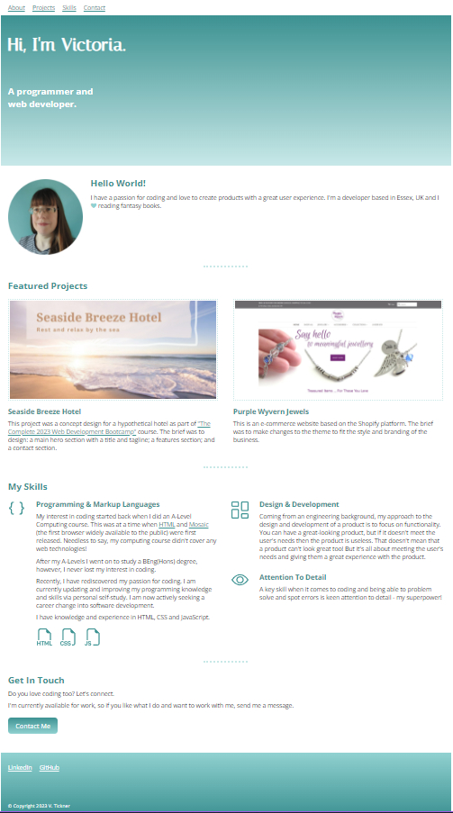

# CAPSTONE PROJECT - Personal Site

This project was set as part of [Angela Yu's "The Complete 2023 Web Development Bootcamp"](https://www.udemy.com/course/the-complete-web-development-bootcamp/) course on Udemy.

## Table of contents

- [Project Description](#project-description)
  - [Example](#example)
  - [Deliverablea](#deliverables)
  - [Features](#features)
  - [Technical Requirements](#technical-requirements)
  - [Process](#process)
- [Personal Portfolio Site](#personal-portfolio-site)
  - [Screenshot](#screenshot)
  - [Links](#links)
- [My process](#my-process)
  - [Built with](#built-with)
  - [What I learned](#what-i-learned)
  - [Continued development](#continued-development)
  - [Useful resources](#useful-resources)
- [Author](#author)

## Project Description

The goal of this project is to create a personal website that showcases your skills, experiences, and interests. The website should be visually appealing and easy to navigate, while also providing relevant information about you and your background. The site should be built entirely with HTML and CSS, with no JavaScript code included.

### Example

[Angela Yu's demonstation example](https://appbrewery.github.io/capstone-2-example)

### Deliverables

- One HTML file for the structure of the website.
- One CSS file for the styling of the website.
- Any additional assets (e.g. images) used in the website.

### Features

- A hero section that provides a brief introduction to you and your background.
- A resume page that lists your education, work experience, skills, and other relevant information.
- A section that showcases any projects or work that you have done in the past.
- An about me section that provides additional information about you and your interests.
- A contact me section that includes information for users to get in touch with you.

### Technical Requirements

- All HTML should be valid and follow proper semantic markup.
- All CSS should be valid and follow best practices for naming conventions and organization.
- The website should be responsive and work on different screen sizes and devices.
- All images used in the website should have appropriate alt text to be accessible.

### Process

- Gather content and design ideas, create wireframes and mockups.
- Develop HTML structure and CSS styling, test on different devices and browsers.
- Finalize design and content, make any necessary revisions, optimize for performance.
- Launch the website and share with others in the Q&A for feedback, make any final adjustments.

## Personal Portfolio Site

### Screenshot

### Links

- Solution URL: [https://github.com/VTickner/Capstone-Project-2](https://github.com/VTickner/Capstone-Project-2)
- Live Site URL: [https://vtickner.github.io/Capstone-Project-2/](https://vtickner.github.io/Capstone-Project-2/)

## My process

- Made a mock up of the website using Canva
- Created the HTML structure of the site and added images plus icons
- Created the CSS styling, creating a responsive layout - focusing on mobile view first and then adjusting the layout for larger screen sizes
- Tested and made revisions to the design so that it would be as responsive as possible

### Built with

- Semantic HTML5 markup
- CSS custom properties
- Flexbox
- CSS Grid
- Mobile-first responsive workflow
- Calculated image sizes
- SVG Icons

### What I learned

I was able to practice changing the amount of columns in CSS grid based on the user's screen size. That along with using a combination of CSS Flexbox and calculated image sizes allowed me to create a responsive design that would adjust to a variety of screen sizes.

I also used CSS gradients for the button and header plus footer sections to add some extra colour to the design.

As one of the requrirements for using CSS was to "follow best practices for naming conventions and organization" I learnt about BEM naming methodology for CSS. I edited my site to follow the BEM naming convention and organised the CSS into various sections.

### Continued development

Further practice with using BEM naming convention, to help with using BEM at the start of writing CSS for a project, rather than editing later as I did on this project.

### Useful resources

- [Canva](https://www.canva.com/) - Canva is a free online graphic design tool. Useful for creating concept designs.
- [Bootstrap SVG Icons](https://icons.getbootstrap.com/) - Free, opensource icon library.
- [CSS Naming Conventions that Will Save You Hours of Debugging](https://www.freecodecamp.org/news/css-naming-conventions-that-will-save-you-hours-of-debugging-35cea737d849/) - Article that explains in basic terms BEM naming methodology for CSS
- [CSS BEM Naming Methodology](https://getbem.com/naming/) - Official BEM site

## Author

- V. Tickner
